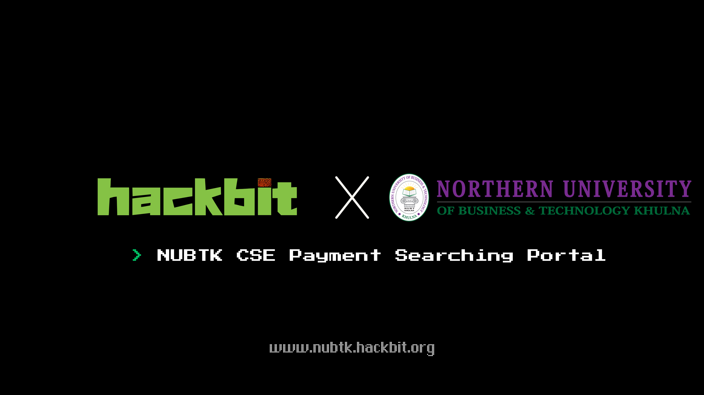

# 📚 NUBTK CSE Payment Portal
 

A modern and user-friendly payment tracking system for students of the **Department of Computer Science & Engineering (CSE)** at **Northern University of Business & Technology Khulna (NUBTK)**. This project solves a real problem where the university only provides payment data in an Excel (.xls) sheet, making it difficult for students to understand their dues, payments, and summaries.



## 🚀 Features

- 🔐 **User Authentication** (Login / Sign-up with email verification)
- 🆔 Student profile creation with ID, phone number, blood group & photo
- 🔍 **Smart Search** using Student ID, Name or Blood Group
- 📈 **Payment Visualizations** with interactive **charts** (Line, Bar, Doughnut)
- 🧾 View tuition fee, scholarship, dues, previous dues, and total received
- 🗒️ Add custom **payment notes** for personal tracking
- 📷 Auto-loading profile images based on student ID
- 🌄 Daily rotating background & splash screen animation
- 📱 Fully responsive and optimized for web and mobile views
- 📊 Summary statistics with live data reload every 30 mins
- 👨‍💻 Developed by: [0xSaikat](https://www.linkedin.com/in/0xsaikat) – HackBit

## 📦 Tech Stack

- **HTML5** / **CSS3** / **JavaScript**
- **Firebase** (Authentication, Firestore, Storage)
- **Chart.js** for dynamic visualizations
- Hosted by **HackBit.org**

## 💡 Why This Project?

Our university only provides a raw `.xls` sheet for payment details which is not intuitive or accessible. To fix this, I built this platform to help fellow students of CSE easily:

- Check their semester fees
- Track how much they have paid
- View remaining dues
- Access their payment summaries in a clean and interactive way

## 💻 Usage

```js
https://nubtk.hackbit.org
```
## 📍 About Me

I am **Sakil Hasan Saikat**, a cybersecurity enthusiast and the founder of [HackBit](https://hackbit.org). I specialize in offensive security, penetration testing, and building automated tools for cybersecurity research. My passion for ethical hacking has driven me to create several tools that contribute to the security community.

You can learn more about my work on my personal website: [https://saikat.hackbit.org](https://saikat.hackbit.org).

Connect with me on [LinkedIn](https://www.linkedin.com/in/0xsaikat/) for updates and collaborations.


## ✨ HackBit

[HackBit](https://hackbit.org) is a cybersecurity-focused organization committed to discovering vulnerabilities, creating solutions, and making the internet a safer place. Join us in our mission to secure the digital world.

##### Waving the Internet Securely!

## 🛡️ License & Credits
- Built with ❤️ by [0xSaikat](https://www.linkedin.com/in/0xsaikat) | HackBit.org
- Profile image fallback uses base64 inline SVG
- Inspired by real student needs in Bangladesh 🇧🇩

This project is licensed under the MIT License - see the [LICENSE](LICENSE) file for details.

<br>
<br>
<br>

<h6 align="center">By the Hackers for the Hackers!</h6>

<div align="center">
  <a href="https://github.com/0xSaikat"></a>
  <a href="https://twitter.com/0xSaikat"></a>
</div>

